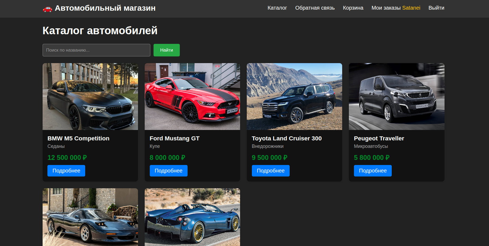
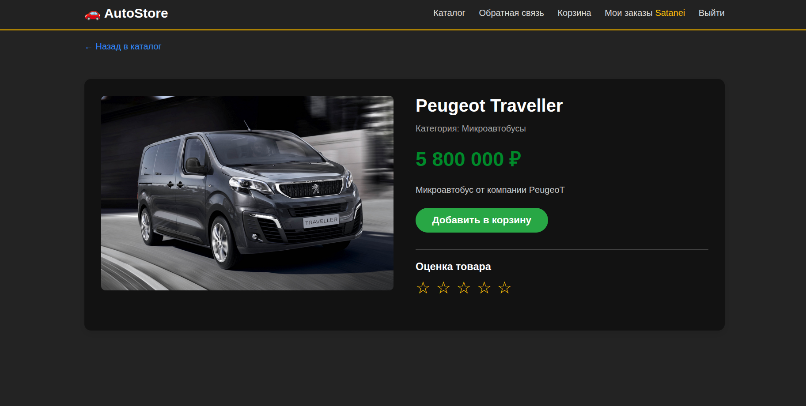
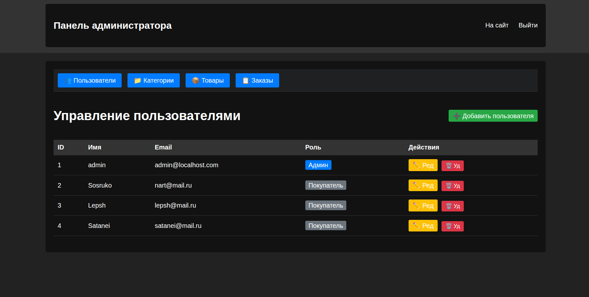

# 🚗 Интернет-магазин автомобилей на Laravel

## 📋 Описание проекта
Веб-приложение "Интернет-магазин автомобилей" с разделением на 3 роли: администратор, покупатель и анонимный пользователь.

## 🛠 Функционал

### Роли пользователей
- **Аноним**: просмотр каталога, поиск, обратная связь
- **Покупатель**: всё что у анонима + корзина, оформление заказов, просмотр своих заказов, оценка товаров
- **Администратор**: всё что у покупателя + управление пользователями, категориями, товарами, просмотр всех заказов

### Основные возможности
- ✅ Каталог товаров с поиском
- ✅ Категории товаров (с поддержкой вложенности)
- ✅ Корзина и оформление заказов
- ✅ Личный кабинет с историей заказов
- ✅ Оценка товаров (рейтинг)
- ✅ Форма обратной связи
- ✅ Недавно просмотренные товары
- ✅ Административная панель (CRUD для всех сущностей)

## 🖥 Технологии
- PHP 8.2
- Laravel 12
- MySQL (MariaDB)
- HTML5, CSS3
- Git

## 📸 Скриншоты

### Главная страница каталога


### Страница товара с оценкой


### Административная панель


## 🚀 Установка и запуск

1. Клонировать репозиторий:
```bash
git clone https://github.com/astemiirr/Web_development.git
cd car-shop
```

Установить зависимости:
```bash
composer install
npm install && npm run build
```

Настроить окружение:
```bash
cp .env.example .env
php artisan key:generate
```

Отредактировать .env - указать данные БД:
```text
DB_DATABASE=car_shop
DB_USERNAME=root
DB_PASSWORD=
Создать базу данных и выполнить миграции:
```

```bash
php artisan migrate
```

Запустить сервер:
```bash
php artisan serve
```

Перейти по адресу: http://127.0.0.1:8000

### Создание администратора
Зарегистрироваться через /register

В phpMyAdmin изменить роль на admin в таблице users

📁 Структура проекта
app/Models - модели данных

app/Http/Controllers - контроллеры

resources/views - шаблоны

routes/web.php - маршруты

database/migrations - миграции БД