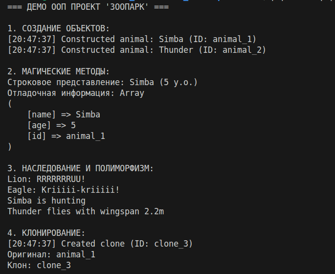
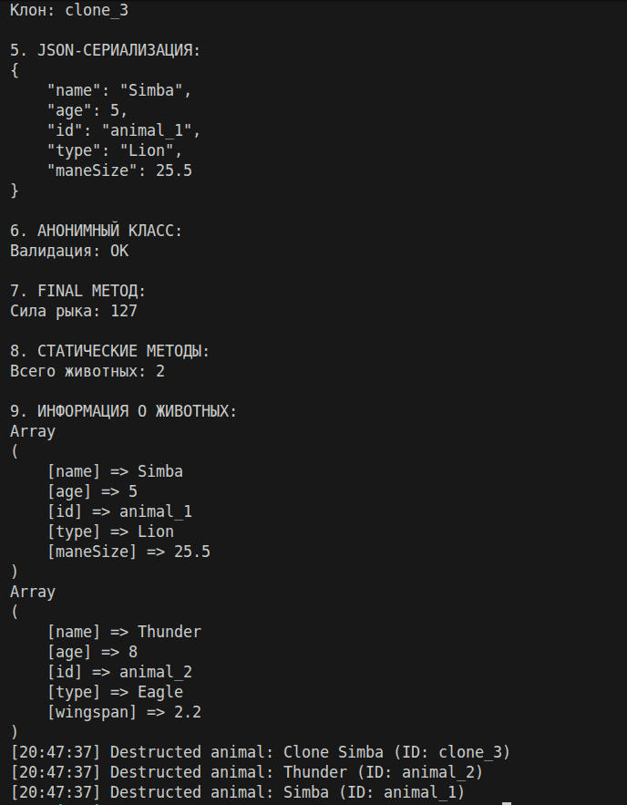

# Домашнее задание по ООП

### Хашпаков Астемир

## 🦁 PHP Zoo: Система управления зоопарком на ООП

Учебный проект на PHP, демонстрирующий ключевые концепции объектно-ориентированного программирования через модель зоопарка.

## ✅ Выполненные требования

1. **Конструктор/деструктор** с валидацией и логированием
2. **Магические методы**: `__toString()`, `__clone()`, `__sleep()`/`__wakeup()`, `__debugInfo()`
3. **Наследование**: `Animal` → `Lion`/`Eagle`
4. **Абстрактный класс** `Animal` с 2 абстрактными методами
5. **Интерфейс** `AnimalInterface`
6. **Трейты**: `LoggerTrait`, `JsonableTrait`
7. **Анонимный класс** (валидатор в `index.php`)
8. **Final**: класс `Lion` и метод `getRoarPower()`
9. **Клонирование** объектов с переопределением `__clone()`
10. **Сериализация** через JSON
11. **Всего классов**: 7 (3 модели + 1 интерфейс + 2 трейт + 1 анонимный)

## 🚀 Быстрый запуск

```bash
# 1. Перейдите в папку проекта
cd OOP/

# 2. Запустите демонстрацию
php index.php

# Или через веб-сервер
php -S localhost:8080
# Откройте http://localhost:8080 в браузере

### Требования
- PHP 7.4 или выше

## 📁 Структура проекта

```
OOP/
├── src/
│   ├── Models/          # Классы животных
│   ├── Interfaces/      # AnimalInterface
│   └── Traits/         # Логирование и сериализация
├── index.php           # Демонстрационный скрипт
├── README.md           # Эта документация
└── .gitignore

## 🧪 Что демонстрирует программа

При запуске `index.php` вы увидите:
- Создание объектов разных типов животных
- Работу наследования и полиморфизма
- Клонирование и сериализацию объектов
- Использование трейтов и анонимных классов
- Пример вывода с логированием действий

## 📸 Пример работы

 

*Результаты выполнения index.php*

---

*Проект создан для демонстрации ООП в PHP. Все требования задания выполнены.*